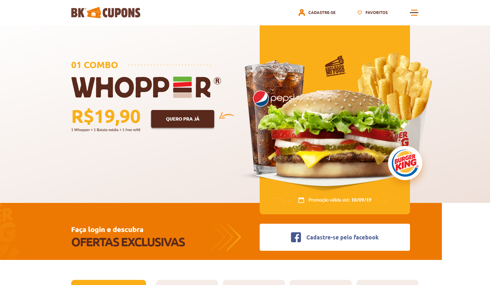

<div align="center">

<h1 align="center">Web Development Case.</h1>
</div>

&nbsp;

<p align="center">
  <a href="#Technologies">Technologies</a>&nbsp;&nbsp;&nbsp;|&nbsp;&nbsp;&nbsp;
  <a href="#Project">Project</a>&nbsp;&nbsp;&nbsp;|&nbsp;&nbsp;&nbsp;
  <a href="#License">License</a>
</p>

<p align="center">
 
  
  
</p>
&nbsp;
&nbsp;
&nbsp;



&nbsp;

## 📖 Sobre o projeto

Este projeto foi desenvolvido para fins de estudos de Desenvolvimento Web. O projeto faz parte de uma campanha publicitária da rede de fast food Burger King.

## 💻 Tecnologias utilizadas no projeto

- [HTML5](https://developer.mozilla.org/pt-BR/docs/Web/HTML)
- [CSS3](https://developer.mozilla.org/pt-BR/docs/Web/CSS)
- [JavaScript](https://developer.mozilla.org/pt-BR/docs/Web/JavaScript)
- [SwiperJS](https://swiperjs.com)

## 🌿 Branches

- `main` projeto finalizado.

## 🎨 Protótipo do projeto

O protótipo do projeto está no [Figma](https://www.figma.com/file/O8Zrg9qBRvajbchiKAwUjE/BK---Cupons?type=design&node-id=1%3A385&mode=design&t=5erzlVVgIqLBMEY3-1).

## 📝 Licença

Este projeto está sob a licença MIT. Consulte a [LICENÇA](./LICENSE.md) para obter mais informações.

## 🗄️ Estrutura de pastas

O projeto está estruturado da seguinte forma:

- 📁 `css`
  - 📄 `style.css`
- 📁 `img`
- 📁 `js`
  - 📄 `scripts.js`
- 📄 `index.html`
- 📄 `README.md`
- 📄 `LICENSE`

## 🛠️ Instruções de execução

Siga as instruções abaixo para clonar o projeto e utilizá-lo da forma que preferir:

```bash
# Clone este repositório

$ git clone

# Acesse a pasta do projeto no seu terminal/cmd

$ cd bk-cupons

# Abra o projeto no seu editor de texto

$ code .

```

<hr>

<div align="center">

Feito com 💜 por [Jhonatan Oliveira](https://jhonatanoliveira.com).

</div>
